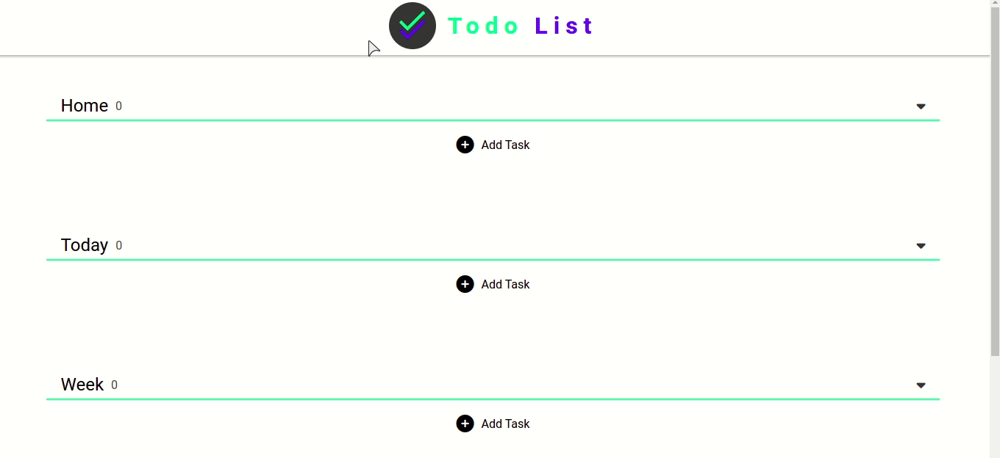

# Todo List

Essa aplicação foi feita como prática de estudo de NodeJs + Express + Sequelize e usando Mysql como banco de dados.</br>
O Front-End foi feito com HTML, CSS e JavaScript</br>

## O que é preciso

- Você precisa ter instalado o [mysql](https://www.mysql.com/);
- criar um banco de dados, de preferência com o nome "todoList", mas pode ser outro nome;
- Alterar as informações do banco de dados no arquivo default.json na pasta config;

## Usando a Aplicação localmente

- Para instalar todas as dependências

```unix
  npm install
```

- E para rodar a aplicação

```unix
cd Todo-list
npm start
```

- Agora é só abrir no navegador - http://localhost:4000/app

## Demo



## O que foi usado

### Back:

- [Node](https://nodejs.org/en/)
- [Express](https://expressjs.com/)
- [Sequelize](https://sequelize.org/)
- [MySql](https://www.mysql.com/)

### Front:

- HTML
- CSS
- JS

### Criar Bundle de JS para os arquivos estáticos

- [Webpack](https://webpack.js.org/)
- [Babel](https://babeljs.io/)

</br>

🚀🚀🚀
